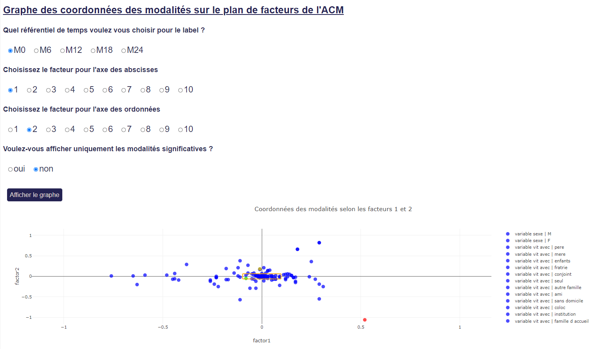
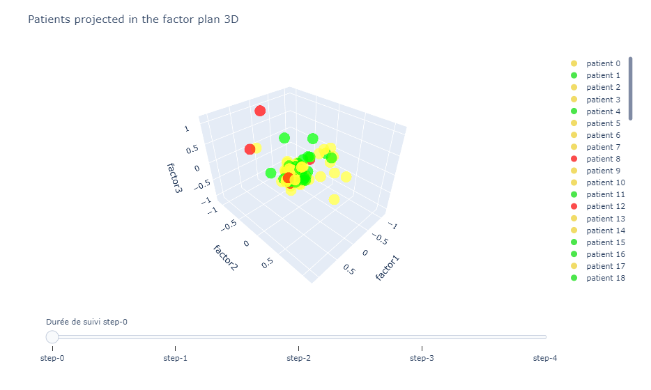
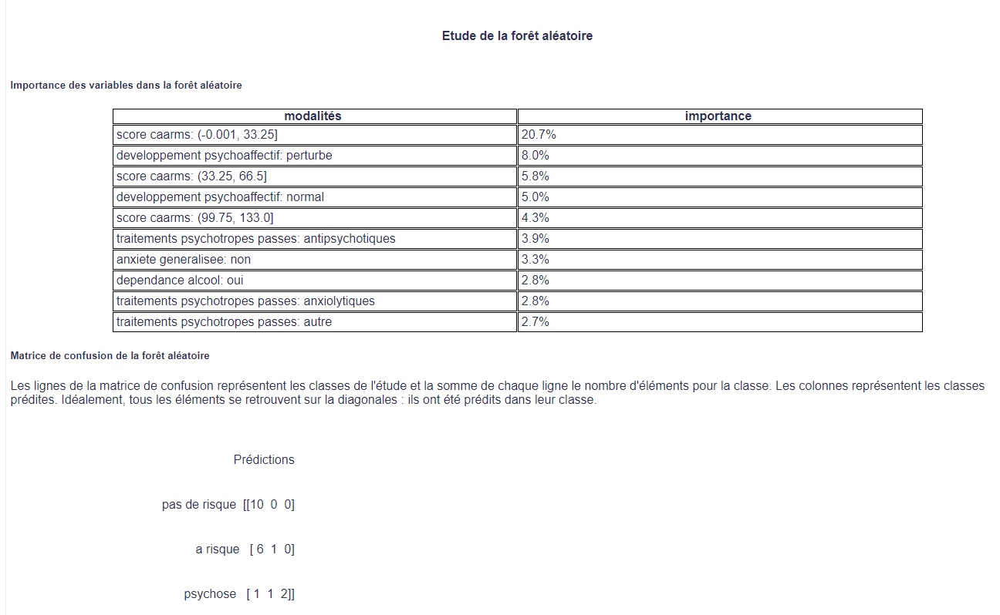

# Schizophrenia

The aim of this project is to develope a Dash application based on docker, containing graphs explaining the data, the results of the ML models and the statistical tests and all modifiable with the dash widgets.

The current available language is French.

## Needs

You need to have Docker and Docker-composed installed.

## Add the data

You have to provide the data in the folder "Data".

## Launch the application 

In the console, the 1st time write the following command:

``docker-compose up --build -d``

If you have already done this command and built the images, just write:
``docker-compose up -d``

Then you can check the local address http://localhost:8000

# Illustration of the application functionalities

These images represent an overview of the dash application. Unfortunatly, this does not reflect
the interactivity of the Dash application which is the main goal of the project.

### Modality graph after the MCA

### Patient graph after the MCA

### Decision tree

### Random forest

# TODO

- Refactor the functions, comments, process 

- process the df for the visualization and for the ML

- re-do the best param of RF

- Re-do the comments of the grap pat 3D

- check the web errors in the console

