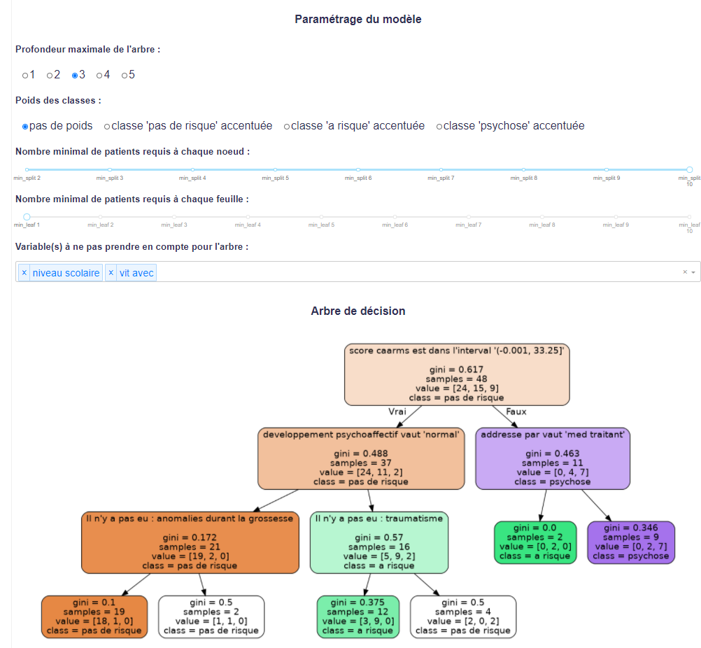

# Schizophrenia

This project uses medical data confidential so not available in this repository.
The aim is to show the code structure and in addition for medical teams providing data respecting the format, to launch the web application. 

The current available language is French.

## Needs

You need to have Docker and Docker-composed installed.

## Add the data

You have to provide the data in the folder "Data".

## Launch the application 

In the console, the 1st time write the following command:

``docker-compose up --build -d``

If you have already done this command and built the images, just write:
``docker-compose up -d``

Then you can check the local address http://localhost:8000

# Illustration of the application functionalities

These images represent an overview of the dash application. Unfortunatly, this does not reflect
the interactivity of the Dash application which is the main goal of the project.

### Modalities graph after the MCA

### Patients graph after the MCA

### Decision tree

### Random forest

# TODO

- Refactor the functions, comments, process 

- process the df for the visualization and for the ML

- accentuate the separation of the ML general parameters from the rest of the code

- Use classes instead of inline css

- Set a max width for decision tree png

- Re do all the css ...

- re-do the best param of RF

- Re-do the comments of the grap pat 3D

- check the web errors in the console

